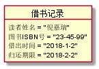
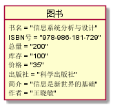
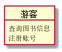
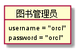
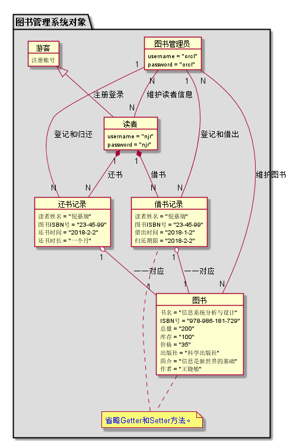
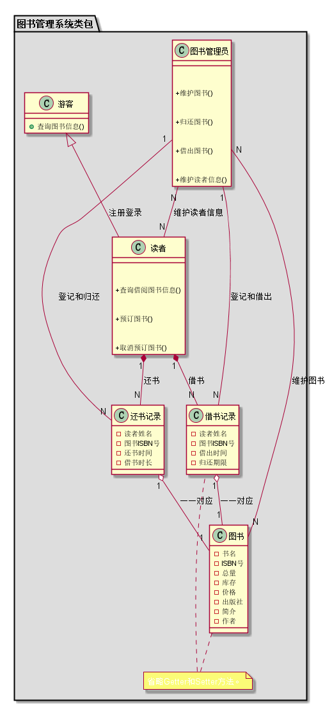
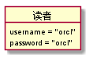

15软工一班-倪嘉瑞
--------------------------
<table>
<tr>
    <th width=40%, bgcolor=withe >姓名</th>
    <th width=40%, bgcolor=withe>学号</th>
    <th width="50%", bgcolor=withe>班级</th>
  </tr>
  <tr>
      <th width=40%, bgcolor=withe >倪嘉瑞</th>
      <th width=40%, bgcolor=withe>201510414115</th>
      <th width="50%", bgcolor=withe>2015级软件工程1班</th>
    </tr>
</table>

实验三：图书管理系统领域对象建模
----------------
##### 流程一：借书记录
##### uml源码如下
```
@startuml

object 借书记录 {
	 	读者姓名 = "倪嘉瑞"
	 	图书ISBN号 = "66-29-66"
	 	借出时间 = "2018-4-10"
	 	归还期限 = "2018-4-20"
}


@endumlml
```
##### 记录如下

##### 流程二：图书对象
##### uml源码如下
```
@startuml

	object 图书 {
	 	书名 = "信息系统分析与设计"
	 	ISBN号 = "978-986-181-729"
	 	总量 = "500"
	 	库存 = "400"
	 	价格 = "19"
	 	出版社 = "科学出版社"
	 	简介 = "信息系统分析与设计是好书"
	 	作者 = "王晓敏"
	}

@endumll
```
##### 记录如下

##### 流程三：游客对象
##### uml源码如下
```
@startuml
 object 游客{
    查询图书信息
    注册账号
 }
@enduml
```
##### 记录如下

##### 流程四：管理员对象
##### uml源码如下
```
@startuml

object 图书管理员 {
		 username = "orcl"
		 password = "orcl"
}


@enduml
```
##### 记录如下

##### 流程五：系统对象
##### uml源码如下
```
@startuml

package "图书管理系统对象" #DDDDDD {

	object 图书管理员 {
		 username = "orcl"
		 password = "orcl"
	}


	object 读者 {
	 	username = "njr"
		password = "njr"
	}
	object 游客 {
		注册账号
	}

	object 图书 {
	 	书名 = "信息系统分析与设计"
	 	ISBN号 = "978-986-181-729"
	 	总量 = "200"
	 	库存 = "100"
	 	价格 = "35"
	 	出版社 = "科学出版社"
	 	简介 = "信息是新世界的基础"
	 	作者 = "王晓敏"
	}

	object 借书记录 {
	 	读者姓名 = "倪嘉瑞"
	 	图书ISBN号 = "23-45-99"
	 	借出时间 = "2018-1-2"
	 	归还期限 = "2018-2-2"
	}
    object 还书记录 {
    	 	读者姓名 = "倪嘉瑞"
            图书ISBN号 = "23-45-99"
            还书时间 = "2018-2-2"
            还书时长 = "一个月"
    	}
	note "<color:blue>省略Getter和Setter方法。</color>" as note1

	图书 .. note1
	note1 .. 借书记录


	游客 <|-- 读者 : 注册登录
	读者 "1" *-- "N" 借书记录 : 借书
	读者 "1" *-- "N" 还书记录 : 还书
	借书记录 "1" o-- "1" 图书 : 一一对应
	还书记录 "1" o-- "1" 图书 : 一一对应
	借书记录 "N" -- "1" 图书管理员 : 登记和借出
	还书记录 "N" -- "1" 图书管理员 : 登记和归还
	图书管理员 "N" -- "N" 图书 : 维护图书
	图书管理员 "N" -- "N" 读者 : 维护读者信息


}


@enduml
```
##### 记录如下

##### 流程六：系统类
##### uml源码如下
```
@startuml

package "图书管理系统类包" #DDDDDD {

	class 图书管理员 {

		+维护图书()
		+归还图书()
		+借出图书()
		+维护读者信息()
	}
	class 读者 {

		+查询借阅图书信息()
		+预订图书()
		+取消预订图书()
	}
	class 游客 {
		+查询图书信息()
	}

	class 图书 {
	 	-书名
	 	-ISBN号
	 	-总量
	 	-库存
	 	-价格
	 	-出版社
	 	-简介
	 	-作者
	}

	class 借书记录 {
	 	-读者姓名
	 	-图书ISBN号
	 	-借出时间
	 	-归还期限
	}
	class 还书记录 {
    	 	-读者姓名
    	 	-图书ISBN号
    	 	-还书时间
    	 	-借书时长
    	}

	 note "<color:white>省略Getter和Setter方法。</color>" as note1

	图书 .. note1
	note1 .. 借书记录
	游客 <|-- 读者 : 注册登录
	读者 "1" *-- "N" 借书记录 : 借书
	读者 "1" *-- "N" 还书记录 : 还书
	借书记录 "1" o-- "1" 图书 : 一一对应
	借书记录 "N" -- "1" 图书管理员 : 登记和借出
	图书管理员 "N" -- "N" 图书 : 维护图书
	图书管理员 "N" -- "N" 读者 : 维护读者信息
	还书记录 "N" -- "1" 图书管理员 : 登记和归还
    还书记录 "1" o-- "1" 图书 : 一一对应

}


@enduml
```
##### 记录如下

##### 流程七：读者对象
##### uml源码如下
```
@startuml
	object 读者 {
	 	username = "orcl"
		password = "orcl"
	}
@enduml
```
##### 记录如下

