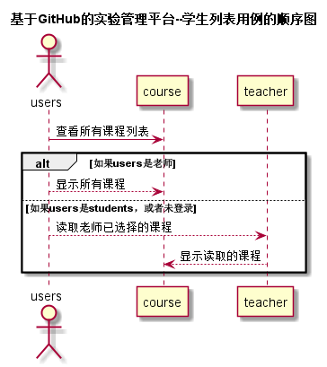

<!-- markdownlint-disable MD033-->
<!-- 禁止MD033类型的警告 https://www.npmjs.com/package/markdownlint -->

# “课程列表”用例 [返回](../README.md)
## 1. 用例规约

|用例名称|学生列表|
|-------|:-------------|
|功能|以下拉列表形式的显示出所有课程|
|参与者|学生，老师|
|前置条件|学生，老师需要先登录|
|后置条件| |
|主事件流| |
|备选事件流| |

## 2. 业务流程（顺序图） [源码](../src/课程列表.puml)
 

## 3. 界面设计
- 界面参照: https://zwdbox.github.io/is_analysis/test6/ui/index.html
- API接口调用
    - 接口1：[getCourse](../implements/getCourse.md) 

## 4. 算法描述

无
    
## 5. 参照表

- [STUDENTS](../数据库设计.md/#STUDENTS)
- [TEACHERS](../数据库设计.md/#GRADES)
- [COURSE](../数据库设计.md/#COURSE)

